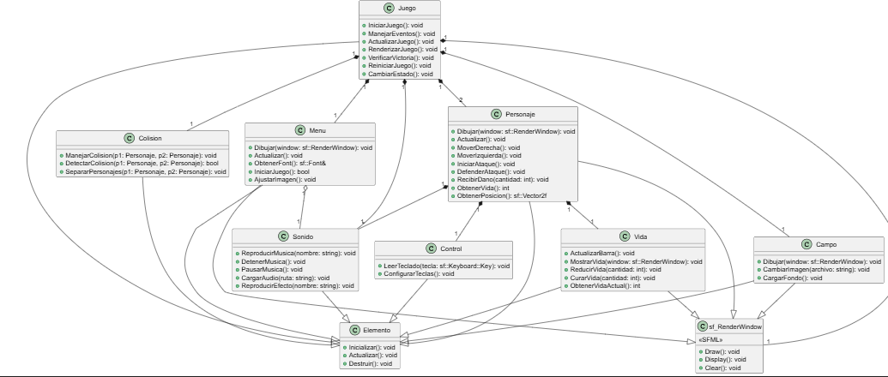

# COBRA KAI

## Describción del juego
Elige tu bando para pelear. Este juego de pelea llamado Cobra Kai trata sobre dos escuelas de karate que enseñan diferentes estilos de combate, con el propósito de defenderse de los abusivos. Elige a tu maestro favorito para ver quién es el mejor. ¿Estás listo?

## ¿Cómo compilar el juego?

1. clonar  repositorio
* https://github.com/Cabrales040104/Cobra-Kai-
2. Abre el Visual Studio
   
3. Busca la carpeta del juego en File Explorer
   
4. En la terminal compila el juego:
* make run
1. Ejecuta con:
* .\main.exe

## ¿Cómo jugar?
* Ejecuta el código
* Los personajes se mueven con: AD y las flechas

` Nota los personajes solo se mueven derecha/izquierda`

* El personaje que se mueve con: AD, golpea con F
* El personaje que se mueve con flechas, golpea con N

## Diagrama de clases PUML

## Menú

## Batalla

## Fin de la partida

## Enlace de funcionamiento del juego
https://drive.google.com/file/d/144HiSyM1Vj1ejJ--cC0ewdmA40R9hw1l/view?usp=sharing